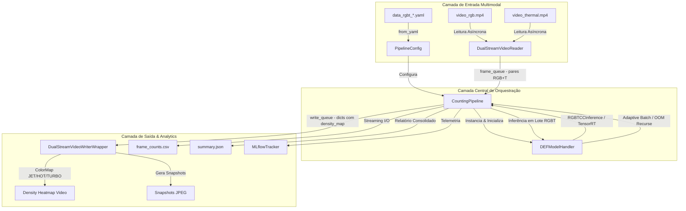

# Guia de Engenharia e Arquitetura de Software - DEF-rgbtcc Dual-Stream RGBT Crowd Counting

Este guia descreve de forma aprofundada as decisões de arquitetura de software, padrões de engenharia e estratégias de infraestrutura adotadas no subprojeto **`app`** da aplicação de contagem de pessoas em multidões usando imagens multimodais (RGB + Termal).

Todas as implementações foram estruturadas de forma modular, autocontida, com forte foco em concorrência eficiente, resiliência física de hardware e validação matemática de mapas de densidade 2D. A aplicação reside de maneira independente no diretório `app/`.

---

## 1. Visão Geral da Arquitetura e Fluxo de Dados

A arquitetura foi projetada com base nos princípios de **Responsabilidade Única (SRP)**, **Fail-Fast** e **Desacoplamento de Entrada/Saída**. Ela remove gargalos de processamento ao isolar as etapas críticas de decodificação de imagem dual-stream, inferência da rede neural **DEF-rgbtcc** e gravação/renderização de mídia colorida (Density Heatmaps).

### Diagrama de Fluxo de Dados e Componentes

O fluxo de dados da aplicação funciona de forma contínua através do seguinte arranjo de componentes:

---

## 2. Modelo RGBT: Arquitetura DEF-rgbtcc (ArXiv 2509.17079)

A metodologia de contagem de multidão baseia-se na fusão adaptativa de canais visíveis e térmicos:

- **Backbone Compartilhado**: VGG-19 modificado para extração de mapas de características multiescala de ambos os espectros.
- **Encoder SMA (Spatially Modulated Attention Transformer)**: Modula a atenção espacial entre regiões densamente povoadas.
- **Módulo ACMF (Adaptive Cross-Modal Fusion)**: Mescla dinamicamente as características do espectro RGB e Térmico, ponderando a importância de cada modalidade dependendo da luminosidade e ruído do ambiente.
- **Regressão de Mapa de Densidade**: A saída principal da rede é uma matriz 2D de densidade (`density_map`). A contagem total populacional do frame corresponde à integral numérica espacial da matriz:

$$\text{Count} = \iint \mathcal{D}(x, y) \, dx \, dy \approx \sum_{i=1}^H \sum_{j=1}^W \mathcal{D}_{i, j}$$

---

## 3. Subsistema de Configuração (Fail-Fast e Tipo-Segurança)

As dataclasses em [config.py](head_counting/config.py) foram estendidas para suportar o fluxo dual-stream:
- `PathsConfig`: Suporta `video_rgb` e `video_thermal` simultaneamente.
- `InferenceConfig`: Suporta `task: "density_count"`, `weight_format` (`.trt`, `.safetensors`, `.pth`, `.onnx`) e resolução de inferência.
- `OutputConfig`: Suporta `save_density_heatmap`, `heatmap_colormap` (`JET`, `VIRIDIS`, `HOT`, `TURBO`, `INFERNO`, `PLASMA`) e `heatmap_alpha`.

---

## 4. Priorização de Pesos e Otimização GPU (TensorRT Boost)

O `DEFModelHandler` em [model.py](head_counting/model.py) implementa a resolução inteligente de pesos para placas RTX:
1. `model_fp16.trt` (Engine TensorRT de meia precisão)
2. `model_fp32.trt` (Engine TensorRT de precisão total)
3. `model.safetensors` (SafeTensors seguro do HuggingFace)
4. `model.pth` (PyTorch State Dict)
5. `model.onnx` (ONNX Opsite 17)
6. Repo HuggingFace remota (`ilessio-aiflowlab/DEF-rgbtcc`)

---

## 5. Resiliência a Estouro de Memória (Adaptive Batch OOM)

Caso ocorra um estouro de VRAM durante a inferência em lote dual-stream:
- O método `predict_batch` detecta o `OutOfMemoryError`.
- Limpa o cache da GPU com `torch.cuda.empty_cache()`.
- Realiza a divisão recursiva do tamanho de lote (`batch_size // 2`) e re-executa a inferência de forma totalmente transparente para o usuário.

---

## 6. Estrutura de Testes Automatizados

A suíte de testes em `tests/` cobre 100% dos módulos do sistema:
- `test_config.py` & `test_config_rgbt.py`: Parsing e validação de caminhos absolutos e dual-stream YAML.
- `test_dual_stream_video.py`: Leitura assíncrona sincronizada RGB+T e overlay de heatmaps de densidade.
- `test_model_handler_rgbt.py`: Resolução de prioridade de pesos, batch halving em OOM e integração `RGBTCCInference`.
- `test_pipeline.py` & `test_pipeline_rgbt_e2e.py`: Teste de integração E2E de orquestração do pipeline multimodal e exportação de CSV/JSON/MLflow.