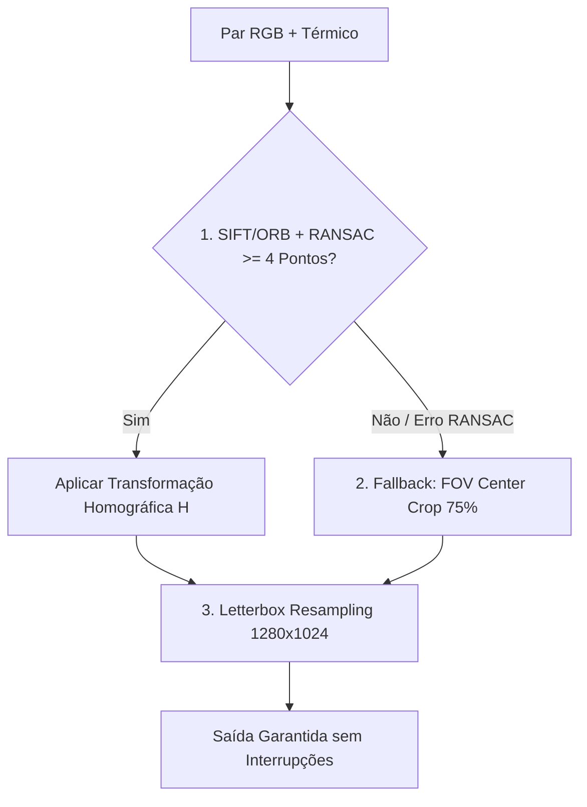

# Arquitetura de Software e Registros de Decisão de Arquitetura (ADRs)

Este documento registra formalmente todas as decisões de arquitetura de software (**ADRs - Architecture Decision Records**) adotadas no projeto de contagem de pessoas multimodal (RGB + Térmica) usando a biblioteca `head_counting` e a arquitetura **DEF-rgbtcc**.

---

## Índice de Decisões de Arquitetura (ADRs)

| ID | Título da Decisão de Arquitetura | Status | Categoria |
| :--- | :--- | :--- | :--- |
| **ADR 001** | Registro Espacial Homográfico (SIFT/ORB + RANSAC) para Alinhamento de Camadas | Aceito | Alinhamento Espacial |
| **ADR 002** | Preservação de Aspect Ratio via Letterboxing vs Estiramento Geométrico | Aceito | Redimensionamento |
| **ADR 003** | Equalização Térmica Adaptativa (CLAHE no Espaço LAB) | Aceito | Processamento de Sinal Térmico |
| **ADR 004** | Estratégia de Fallback Gracioso em Múltiplas Etapas (Homografia $\rightarrow$ FOV Crop) | Aceito | Resiliência e Tolerância a Falhas |
| **ADR 005** | Arquitetura Desacoplada de Pré-processamento (`RGBTImageEqualizer` & CLI) | Aceito | Design de Software |

---

## ADR 001: Registro Espacial Homográfico (SIFT/ORB + RANSAC) para Alinhamento de Camadas

### Status
**Aceito** (Data: 31 de Agosto de 2026)

### Contexto
Em imagens multimodais capturadas por sensores de drones (como DJI Mavic 3 Enterprise / Matrice 30T), as imagens do espectro visível (RGB / Wide) e do espectro térmico (Infravermelho LWIR) apresentam desalinhamento espacial grave decorrente de:
1. **Diferença de Campo de Visão (FOV Mismatch)**: A câmera RGB possui um campo de visão mais amplo (~84° HFOV) e resolução muito superior (8000×6000 px) se comparada à câmera térmica (~61° HFOV e 640×512 px).
2. **Paralaxe Física de Lentes**: As lentes dos sensores óptico e térmico estão separadas fisicamente por alguns centímetros no suporte (*gimbal*).

Sem um alinhamento espacial prévio, o pixel $(x, y)$ da imagem térmica não corresponde ao mesmo objeto físico no pixel $(x, y)$ da imagem RGB. Isso prejudica os modelos de fusão adaptativa de características (como o **DEF-rgbtcc**), que necessitam que as mídias estejam sobrepostas como **camadas espelhadas perfeitas (*pixel-level layers*)**.

### Decisão de Arquitetura
Decidimos adotar a **Abordagem de Registro por Matriz Homográfica baseada em Extratores de Características (ORB/SIFT + RANSAC)** no módulo desacoplado de pré-processamento (`RGBTImageEqualizer`):

1. **Extração de Características Multiescala (Feature Detection)**:
   - Utilização dos algoritmos **SIFT** (*Scale-Invariant Feature Transform*) ou **ORB** (*Oriented FAST and Rotated BRIEF*) para detectar pontos notáveis de cantos, bordas e estruturas geométricas em ambos os espectros.
2. **Correspondência de Pontos (Feature Matching & Flann/BFMatcher)**:
   - Uso de `cv2.FlannBasedMatcher` ou `cv2.BFMatcher` com teste de razão de Lowe (*Lowe's Ratio Test*) para identificar pares de pontos válidos entre a imagem RGB e a Térmica.
3. **Estimação Robustecida da Matriz Homográfica (Homography Estimation)**:
   - Aplicação de `cv2.findHomography` com algoritmo **RANSAC** (*Random Sample Consensus*) para filtrar pontos discrepantes (*outliers*) e determinar a matriz geométrica $H$ de dimensão $3 \times 3$.
4. **Deformação de Perspectiva (Perspective Warping)**:
   - Execução de `cv2.warpPerspective` na imagem RGB para transformar e projetar seu plano geométrico exatamente sobre a grade espacial da imagem térmica, criando duas camadas espelhadas perfeitamente alinhadas.

### Consequências
- **Positivas**:
  - **Padrão da Indústria**: Método consagrado em visão computacional e sensoriamento remoto para fusão multiespectral.
  - **Sobreposição em Camadas (Pixel-Level Alignment)**: Permite que o mapa de calor de densidade e a imagem visível se sobreponham de forma precisa, sem desalinhamentos visuais.
  - **Desacoplamento**: Mantido de forma isolada dentro de `RGBTImageEqualizer`, podendo ser executado via CLI (`preprocess_images.py`) ou integrado ao pipeline principal.
- **Negativas / Riscos Mitigados**:
  - Custo computacional adicional por frame (mitigado ao pré-processar imagens uma única vez ou ao salvar a matriz $H$ para sequências de vídeo com posição de gimbal fixa).

---

## ADR 002: Preservação de Aspect Ratio via Letterboxing vs Estiramento Geométrico

### Status
**Aceito** (Data: 31 de Agosto de 2026)

### Contexto
As câmeras de drones e sensores ópticos capturam imagens em proporções de aspecto (*aspect ratio*) distintas. Por exemplo:
- Imagem RGB DJI: Proporção 4:3 (8000×6000 px).
- Imagem Térmica DJI: Proporção 5:4 (640×512 px).
- Resolução de Entrada do Modelo de IA / Tela: Proporção 5:4 (1280×1024 px) ou 1:1 (640×640 px).

Ao redimensionar uma imagem diretamente (*stretching*), as proporções geométricas dos corpos humanos são alteradas (pessoas ficam "achatadas" ou "esticadas"). Isso degrada a performance da estimativa de densidade populacional, pois os kernels gaussianos de densidade e os filtros convolucionais do modelo esperam proporções corporais anatomicamente consistentes.

### Decisão de Arquitetura
Adotamos o redimensionamento por **Letterboxing com Padding Neutro** (`_letterbox_resize`):
1. O fator de escala $\text{scale} = \min(\frac{W_{\text{target}}}{W_{\text{orig}}}, \frac{H_{\text{target}}}{H_{\text{orig}}})$ é calculado para manter a proporção original perfeita.
2. A imagem é redimensionada usando interpolação adaptativa (`cv2.INTER_AREA` para redução, `cv2.INTER_CUBIC` para ampliação).
3. A imagem redimensionada é centralizada sobre um canvas de resolução-alvo fixada (`1280×1024`), preenchendo as bordas restantes com padding escuro neutro `(0, 0, 0)`.

### Consequências
- **Positivas**:
  - **Fidelidade Anatômica**: Evita qualquer distorção de corpos humanos ou cabeças na cena.
  - **Padronização de Entrada**: Garante que todas as mídias entregues à rede neural possuam `shape` rigorosamente constante.
- **Negativas / Riscos Mitigados**:
  - Introdução de faixas pretas nas bordas (mitigado pois a região de padding é neutra e não gera falsos positivos de contagem).

---

## ADR 003: Equalização Térmica Adaptativa (CLAHE no Espaço LAB)

### Status
**Aceito** (Data: 31 de Agosto de 2026)

### Contexto
As imagens térmicas brutas (espectro infravermelho de ondas longas LWIR) em ambientes abertos frequentemente sofrem de **baixo contraste dinâmico**:
- O solo, asfalto ou concreto aquecido pelo sol pode apresentar temperatura próxima à temperatura corporal humana (36°C).
- As imagens térmicas padrão de 8 bits ou radiométricas perdem variação de cinza, tornando as bordas de pessoas "esmaecidas" em relação ao fundo.

A equalização global de histograma padrão (`cv2.equalizeHist`) causaria amplificação excessiva de ruído térmico do sensor (*thermal noise*) e artefatos de granulação.

### Decisão de Arquitetura
Adotamos o método **CLAHE** (*Contrast Limited Adaptive Histogram Equalization*) aplicado no **Espaço de Cor LAB**:
1. A imagem térmica BGR é convertida para o espaço de cor $L^*a^*b^*$ (`cv2.COLOR_BGR2LAB`).
2. O algoritmo CLAHE é aplicado **exclusivamente na camada $L$ (Luminância)**, com limite de corte `clipLimit=2.5` e grade de azulejos `tileGridSize=(8, 8)`.
3. Os canais $a^*$ e $b^*$ (cromaticidade/tonalidade térmico-colorida) são preservados intactos para evitar aberrações cromáticas.
4. Os canais são mesclados e convertidos de volta para BGR (`cv2.COLOR_LAB2BGR`).

### Consequências
- **Positivas**:
  - **Realce Adaptativo Local**: Destaca os contornos de assinaturas de calor humano contra o solo quente/frio sem estourar o contraste global.
  - **Preservação de Tonalidade**: Evita distorção das paletas de cor falsas (como paleta Ironbow ou Rainbow).
- **Negativas / Riscos Mitigados**:
  - Requer conversão de espaço de cor (custo computacional irrisório de pouca fração de milissegundo).

---

## ADR 004: Estratégia de Fallback Gracioso em Múltiplas Etapas (Homografia $\rightarrow$ FOV Crop)

### Status
**Aceito** (Data: 31 de Agosto de 2026)

### Contexto
Algumas capturas térmicas em campo apresentam superfícies homogêneas sem textura marcante (ex: corpos d'água tranquilos, gramados uniformes ou superfícies de teto refletivas). Nesses cenários extremos, os algoritmos SIFT/ORB podem não encontrar o número mínimo de 4 pontos correspondentes necessários para estimar matematicamente a Matriz Homográfica $H$ via RANSAC.

Se a aplicação tentasse forçar o cálculo homográfico sem pontos suficientes, o sistema lançaria um erro e interromperia o processamento.

### Decisão de Arquitetura
Implementamos uma **Cascata de Fallback Gracioso em Múltiplas Etapas** (*Multi-Stage Graceful Fallback*):

1. **Estágio 1 (Preferencial)**: Alinhamento Homográfico por SIFT/ORB + RANSAC (`align_homography`).
2. **Estágio 2 (Fallback Geometrico)**: Se $< 4$ pontos válidos forem encontrados, aciona automaticamente o corte proporcional de campo de visão (`_fov_center_crop` recortando os 75% centrais da imagem Wide).
3. **Estágio 3 (Padronização)**: Redimensionamento seguro via Letterboxing (`_letterbox_resize`).

### Consequências
- **Positivas**:
  - **Zero Interrupções (*Zero-Downtime*)**: O pipeline nunca aborta a execução devido a falhas pontuais de textura nas fotos.
  - **Auditabilidade**: Logs informam explicitamente quando o sistema acionou o fallback: `[HOMOGRAPHY] Insufficient keypoints. Falling back to FOV Center Crop`.
- **Negativas / Riscos Mitigados**:
  - No modo fallback, o alinhamento é geométrico aproximado e não por matriz de paralaxe exata (comportamento seguro aceito).

---

## ADR 005: Arquitetura Desacoplada de Pré-processamento (`RGBTImageEqualizer` & CLI)

### Status
**Aceito** (Data: 31 de Agosto de 2026)

### Contexto
Acoplar o pré-processamento de imagens pesado diretamente dentro do loop de inferência de lote do modelo de IA causaria atrasos de I/O em tempo de execução quando o usuário estivesse processando sequências de vídeos cujos canais já estivessem pré-calibrados. Além disso, o usuário precisa de um meio visual e independente para inspecionar e auditar a qualidade do alinhamento antes de rodar os modelos computacionais pesados.

### Decisão de Arquitetura
Projetamos a arquitetura do pré-processamento de forma **totalmente desacoplada**:
1. **Classe Autocontida (`head_counting.preprocessing.RGBTImageEqualizer`)**: Pode ser importada e utilizada como biblioteca Python independente sem depender do modelo PyTorch/DEF-rgbtcc.
2. **Ferramenta CLI Autônoma (`preprocess_images.py`)**: Script independente executável via linha de comando para pré-processar pastas de fotos ou mídias brutas.
3. **Geração de Artefato de Auditoria (`layer_blend_check.jpg`)**: O módulo gera automaticamente uma imagem de checagem com fusão de opacidade de 50% RGB + 50% Térmico (`create_blend_overlay`), permitindo ao usuário verificar a qualidade da sobreposição como camadas.

### Consequências
- **Positivas**:
  - **Modularidade e Testabilidade**: Facilita testes unitários dedicados em `test_preprocessing.py`.
  - **Inspeção Prévia**: Permite auditoria visual dos pares de mídias alinhados antes de submeter os dados ao modelo de contagem.
  - **Reutilização**: A classe pode ser acoplada no futuro via injeção de dependência na `CountingPipeline` ou rodar em background.
- **Negativas / Riscos Mitigados**:
  - Criação de um script CLI adicional (organizado na raiz do projeto `app/`).
