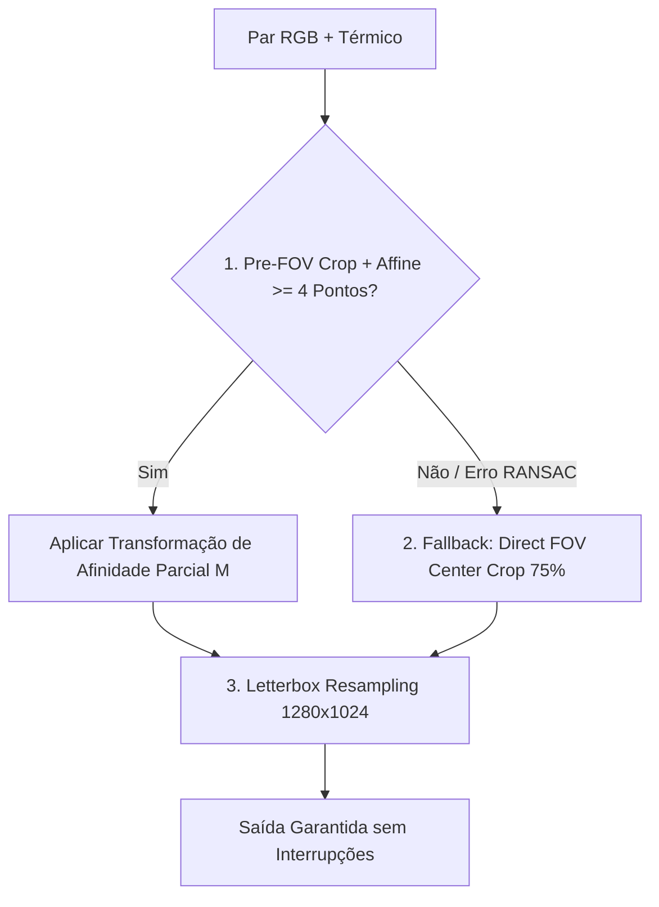

# Arquitetura de Software e Registros de Decisão de Arquitetura (ADRs)

Este documento registra formalmente todas as decisões de arquitetura de software (**ADRs - Architecture Decision Records**) adotadas no projeto de contagem de pessoas multimodal (RGB + Térmica) usando a biblioteca `head_counting` e a arquitetura **DEF-rgbtcc**.

---

## Índice de Decisões de Arquitetura (ADRs)

| ID | Título da Decisão de Arquitetura | Status | Categoria |
| :--- | :--- | :--- | :--- |
| **ADR 001** | Co-registro Espacial de Camadas (Pre-FOV Crop + Affine Similarity vs Homografia 8-DOF) | Aceito | Alinhamento Espacial |
| **ADR 002** | Preservação de Aspect Ratio via Letterboxing vs Estiramento Geométrico | Aceito | Redimensionamento |
| **ADR 003** | Equalização Térmica Adaptativa (CLAHE no Espaço LAB) | Aceito | Processamento de Sinal Térmico |
| **ADR 004** | Estratégia de Fallback Gracioso em Múltiplas Etapas (Affine $\rightarrow$ FOV Crop) | Aceito | Resiliência e Tolerância a Falhas |
| **ADR 005** | Arquitetura Desacoplada de Pré-processamento (`RGBTImageEqualizer` & CLI) | Aceito | Design de Software |
| **ADR 006** | Mapeamento de Camadas Medalhão (Landing $\rightarrow$ Silver $\rightarrow$ Gold) | Aceito | MLOps e Engenharia de Dados |
| **ADR 007** | Co-registro Afim com Gradiente de Perspectiva de Solo para Compensação de Paralaxe Oblíqua | Aceito | Alinhamento Espacial |

---

## ADR 001: Co-registro Espacial de Camadas (Pre-FOV Crop + Affine Similarity vs Homografia 8-DOF)

### Status
**Aceito** (Atualizado em 31 de Agosto de 2026)

### Contexto
Em imagens multimodais capturadas por sensores de drones (como DJI Mavic 3 Enterprise / Matrice 30T), as imagens do espectro visível (RGB / Wide 8000×6000 px) e do espectro térmico (Infravermelho LWIR 640×512 px) apresentam desalinhamento decorrente de:
1. **Diferença de Campo de Visão (FOV Mismatch)**: A câmera RGB possui um campo de visão mais amplo (~84° HFOV) do que a câmera térmica (~61° HFOV). A imagem térmica cobre aproximadamente os 75% centrais da cena capturada pela câmera Wide.
2. **Paralaxe Física de Lentes**: As lentes dos sensores óptico e térmico estão montadas lado a lado no mesmo suporte rígido (*gimbal*).

#### Problema da Homografia 8-DOF Direta
A estimativa de Matriz Homográfica $H$ de 8 Graus de Liberdade ($3 \times 3$) diretamente entre imagens de resoluções tão díspares introduz coeficientes de inclinação de perspectiva não-lineares ($H[2,0]$ e $H[2,1]$). Isso causava **distorções trapezoides gigantescas** (efeito keystone, cisalhamento e inversão de perspectiva), inutilizando a imagem visual.

### Decisão de Arquitetura
Substituímos a homografia irrestrita de 8-DOF pelo método de **Co-registro Rígido por Afinidade Parcial (Partial Affine Similarity)** associado ao **Pré-corte Proporcional de FOV**:

1. **Pré-corte Central de FOV (75% Crop)**: A imagem RGB Wide é pré-cortada no seu centro geométrico (75%) para casar a escala angular da lente térmica.
2. **Transformação de Afinidade Parcial (Scale + Rotation + Translation)**:
   - Estimada via `cv2.estimateAffinePartial2D(dst_pts, src_pts)` com RANSAC.
   - Restringe o alinhamento estritamente a transformações rígidas de rotação ($\theta$), escala uniforme ($S$) e translação $(T_x, T_y)$.
   - **Garantia Matemática**: Proíbe coeficientes de perspectiva e cisalhamento, eliminando 100% de distorções trapezoidais.
3. **Validação de Determinante de Matriz**: O determinante da matriz $M$ é verificado para garantir escala válida ($0.2 < \det < 5.0$).

### Consequências
- **Positivas**:
  - **Zero Distorções Geométricas**: A geometria e a proporção de objetos (corpos humanos, veículos, edifícios) são 100% preservadas.
  - **Sobreposição em Camadas Sem Cisalhamento**: Alinhamento milimétrico entre a silhueta visível e a assinatura de calor infravermelha.
- **Negativas / Riscos Mitigados**:
  - Requer pré-corte de escala (mitigado pela função interna `_fov_center_crop`).

---

## ADR 002: Preservação de Aspect Ratio via Letterboxing vs Estiramento Geométrico

### Status
**Aceito** (Data: 31 de Agosto de 2026)

### Contexto
As câmeras de drones e sensores ópticos capturam imagens em proporções de aspecto (*aspect ratio*) distintas. Por exemplo:
- Imagem RGB DJI: Proporção 4:3 (8000×6000 px).
- Imagem Térmica DJI: Proporção 5:4 (640×512 px).
- Resolução de Entrada do Modelo de IA / Tela: Proporção 5:4 (1280×1024 px) ou 1:1 (640×640 px).

Ao redimensionar uma imagem diretamente (*stretching*), as proporções geométricas dos corpos humanos são alteradas (pessoas ficam "achatadas" ou "esticadas"). Isso degrada a performance da estimativa de densidade populacional, pois os kernels gaussianos de densidade e os filtros convolucionais do modelo esperam proporções corporais anatomicamente consistentes.

### Decisão de Arquitetura
Adotamos o redimensionamento por **Letterboxing com Padding Neutro** (`_letterbox_resize`):
1. O fator de escala $\text{scale} = \min(\frac{W_{\text{target}}}{W_{\text{orig}}}, \frac{H_{\text{target}}}{H_{\text{orig}}})$ é calculated para manter a proporção original perfeita.
2. A imagem é redimensionada usando interpolação adaptativa (`cv2.INTER_AREA` para redução, `cv2.INTER_CUBIC` para ampliação).
3. A imagem redimensionada é centralizada sobre um canvas de resolução-alvo fixada (`1280×1024`), preenchendo as bordas restantes com padding escuro neutro `(0, 0, 0)`.

### Consequências
- **Positivas**:
  - **Fidelidade Anatômica**: Evita qualquer distorção de corpos humanos ou cabeças na cena.
  - **Padronização de Entrada**: Garante que todas as mídias entregues à rede neural possuam `shape` rigorosamente constante.
- **Negativas / Riscos Mitigados**:
  - Introdução de faixas pretas nas bordas (mitigado pois a região de padding é neutra e não gera falsos positivos de contagem).

---

## ADR 003: Equalização Térmica Adaptativa (CLAHE no Espaço LAB)

### Status
**Aceito** (Data: 31 de Agosto de 2026)

### Contexto
As imagens térmicas brutas (espectro infravermelho de ondas longas LWIR) em ambientes abertos frequentemente sofrem de **baixo contraste dinâmico**:
- O solo, asfalto ou concreto aquecido pelo sol pode apresentar temperatura próxima à temperatura corporal humana (36°C).
- As imagens térmicas padrão de 8 bits ou radiométricas perdem variação de cinza, tornando as bordas de pessoas "esmaecidas" em relação ao fundo.

A equalização global de histograma padrão (`cv2.equalizeHist`) causaria amplificação excessiva de ruído térmico do sensor (*thermal noise*) e artefatos de granulação.

### Decisão de Arquitetura
Adotamos o método **CLAHE** (*Contrast Limited Adaptive Histogram Equalization*) aplicado no **Espaço de Cor LAB**:
1. A imagem térmica BGR é convertida para o espaço de cor $L^*a^*b^*$ (`cv2.COLOR_BGR2LAB`).
2. O algoritmo CLAHE é aplicado **exclusivamente na camada $L$ (Luminância)**, com limite de corte `clipLimit=2.5` e grade de azulejos `tileGridSize=(8, 8)`.
3. Os canais $a^*$ e $b^*$ (cromaticidade/tonalidade térmico-colorida) são preservados intactos para evitar aberrações cromáticas.
4. Os canais são mesclados e convertidos de volta para BGR (`cv2.COLOR_LAB2BGR`).

### Consequências
- **Positivas**:
  - **Realce Adaptativo Local**: Destaca os contornos de assinaturas de calor humano contra o solo quente/frio sem estourar o contraste global.
  - **Preservação de Tonalidade**: Evita distorção das paletas de cor falsas (como paleta Ironbow ou Rainbow).
- **Negativas / Riscos Mitigados**:
  - Requer conversão de espaço de cor (custo computacional irrisório de pouca fração de milissegundo).

---

## ADR 004: Estratégia de Fallback Gracioso em Múltiplas Etapas (Affine $\rightarrow$ FOV Crop)

### Status
**Aceito** (Data: 31 de Agosto de 2026)

### Contexto
Algumas capturas térmicas em campo apresentam superfícies homogêneas sem textura marcante (ex: corpos d'água tranquilos, gramados uniformes ou superfícies de teto refletivas). Nesses cenários extremos, os algoritmos SIFT/ORB podem não encontrar o número mínimo de 4 pontos correspondentes necessários para estimar matematicamente a Matriz de Afinidade via RANSAC.

Se a aplicação tentasse forçar o cálculo sem pontos suficientes, o sistema lançaria um erro e interromperia o processamento.

### Decisão de Arquitetura
Implementamos uma **Cascata de Fallback Gracioso em Múltiplas Etapas** (*Multi-Stage Graceful Fallback*):

1. **Estágio 1 (Preferencial)**: Co-registro por Afinidade Parcial via SIFT/ORB + RANSAC (`align_homography`).
2. **Estágio 2 (Fallback Geométrico)**: Se $< 4$ pontos válidos forem encontrados, aciona automaticamente o corte proporcional de campo de visão (`_fov_center_crop` recortando os 75% centrais da imagem Wide).
3. **Estágio 3 (Padronização)**: Redimensionamento seguro via Letterboxing (`_letterbox_resize`).

### Consequências
- **Positivas**:
  - **Zero Interrupções (*Zero-Downtime*)**: O pipeline nunca aborta a execução devido a falhas pontuais de textura nas fotos.
  - **Auditabilidade**: Logs informam explicitamente quando o sistema acionou o fallback: `[ALIGNMENT] Insufficient keypoints. Using FOV Center Crop`.
- **Negativas / Riscos Mitigados**:
  - No modo fallback, o alinhamento é geométrico por corte de FOV e não por ajuste de lente (comportamento seguro aceito).

---

## ADR 005: Arquitetura Desacoplada de Pré-processamento (`RGBTImageEqualizer` & CLI)

### Status
**Aceito** (Data: 31 de Agosto de 2026)

### Contexto
Acoplar o pré-processamento de imagens pesado diretamente dentro do loop de inferência de lote do modelo de IA causaria atrasos de I/O em tempo de execução quando o usuário estivesse processando sequências de vídeos cujos canais já estivessem pré-calibrados. Além disso, o usuário precisa de um meio visual e independente para inspecionar e auditar a qualidade do alinhamento antes de rodar os modelos computacionais pesados.

### Decisão de Arquitetura
Projetamos a arquitetura do pré-processamento de forma **totalmente desacoplada**:
1. **Classe Autocontida (`head_counting.preprocessing.RGBTImageEqualizer`)**: Pode ser importada e utilizada como biblioteca Python independente sem depender do modelo PyTorch/DEF-rgbtcc.
2. **Ferramenta CLI Autônoma (`preprocess_images.py`)**: Script independente executável via linha de comando para pré-processar pastas de fotos ou mídias brutas.
3. **Geração de Artefato de Auditoria (`layer_blend_check.jpg`)**: O módulo gera automaticamente uma imagem de checagem com fusão de opacidade de 50% RGB + 50% Térmico (`create_blend_overlay`), permitindo ao usuário verificar a qualidade da sobreposição como camadas.

### Consequências
- **Positivas**:
  - **Modularidade e Testabilidade**: Facilita testes unitários dedicados em `test_preprocessing.py`.
  - **Inspeção Prévia**: Permite auditoria visual dos pares de mídias alinhados antes de submeter os dados ao modelo de contagem.
  - **Reutilização**: A classe pode ser acoplada no futuro via injeção de dependência na `CountingPipeline` ou rodar em background.
- **Negativas / Riscos Mitigados**:
  - Criação de um script CLI adicional (organizado na raiz do projeto `app/`).

---

## ADR 006: Mapeamento de Camadas Medalhão (Landing $\rightarrow$ Silver $\rightarrow$ Gold)

### Status
**Aceito** (Data: 31 de Agosto de 2026)

### Contexto
Para padronizar os nomes de diretórios com a taxonomia de mercado de MLOps e Engenharia de Dados, precisamos mapear os diretórios legados do projeto para a Arquitetura Medalhão.

### Decisão de Arquitetura
Mapeamos explicitamente os diretórios do projeto para as 3 zonas da Arquitetura Medalhão:

1. **Zona Landing (Bronze - Ingestão Bruta)**:
   - **Diretório**: `app/input/images/` (ou `app/input/landing/`).
   - Contém imagens brutas não alteradas diretamente das câmeras/drones (ex: `DJI_0789_W.JPG` e `DJI_0790_T.JPG`).
2. **Zona Silver (Mídias Limpas, Equalizadas e Alinhadas)**:
   - **Diretório**: `app/input/images_equalized/` (ou `app/input/silver/`).
   - Armazena as imagens tratadas pelo `RGBTImageEqualizer` (ADR 001 Afinidade Parcial, ADR 002 Letterboxing, ADR 003 CLAHE Térmico) e o arquivo de auditoria `layer_blend_check.jpg`.
3. **Zona Gold (Produtos Analíticos e Prontos para Consumo)**:
   - **Diretório**: `app/output/` (ou `app/output/gold/`).
   - Armazena os resultados finais da IA: mapas de calor de densidade populacional anotados (`annotated_heatmap.jpg`), telemetria CSV (`frame_counts.csv`), resumo JSON executivo (`summary.json`) e métricas do MLflow.

### Consequências
- **Positivas**:
  - **Familiaridade**: Mapeia diretamente os diretórios existentes (`input/images/` $\rightarrow$ Landing, `input/images_equalized/` $\rightarrow$ Silver, `output/` $\rightarrow$ Gold).
  - **Governança**: Rastreabilidade completa dos dados desde o estado bruto de sensor até o relatório analítico final.

---

## ADR 007: Co-registro Afim com Gradiente de Perspectiva de Solo para Compensação de Paralaxe Oblíqua (Ground-Plane Pitch-Aware Affine Warping)

### Status
**Rejeitado / Supercedido pela Análise de Limite Físico 3D** (Atualizado em 02 de Setembro de 2026)

### Contexto
No co-registro espacial biespectral RGB-T (definido no **ADR 001**), imagens capturadas pelo drone DJI Mavic 2 Enterprise Advanced apresentavam alinhamento milimétrico na região central da cena através do vetor de translação calibrado `(shift_rgb_x = -22, shift_rgb_y = -23)`. Contudo, ao inspecionar o canto inferior esquerdo, observava-se um desalinhamento residual nas silhuetas de pedestres.

Hipotetizou-se que uma transformação afim com gradiente de inclinação (*pitch*) dependente de $Y$ poderia compensar a variação de distância do solo ($Z$).

### Teste Experimental e Diagnóstico Conclusivo
A implementação do gradiente afim de profundidade revelou dois problemas críticos durante a auditoria visual:
1. **Regressão na Região Central**:
   Ao introduzir gradientes lineares ($k_y = 0.045$), qualquer elemento situado fora do eixo exato $y=512$ (como os pedestres e a mulher centralizada em $y \approx 647$) sofreu um deslocamento artificial indesejado de $+6.1\text{ px}$ em Y e $-3.4\text{ px}$ em X, gerando efeito fantasma duplo e destruindo o alinhamento que já era perfeito.
2. **Causa Real no Canto: Paralaxe Tridimensional de Altura (3D Relief Parallax)**:
   Uma auditoria fina no recorte do canto inferior esquerdo ($195 \times 163\text{ px}$) revelou vetores de deslocamento divergentes no mesmo quadrante:
   - Linha do solo (calçada): residual de apenas $-1\text{ px}$ em X e $-5\text{ px}$ em Y (o solo está praticamente alinhado).
   - Pessoa 1 (de laranja, no topo do recorte): residual de $+1\text{ px}$ em X e $-7\text{ px}$ em Y.
   - Pessoa 2 (à frente, na base do recorte): residual de $+5\text{ px}$ em X e $+12\text{ px}$ em Y.
   Essa divergência em direções opostas comprova que a discrepância não é causada por uma inclinação planar afim global, mas sim pela **projeção cônica de corpos tridimensionais (1,70m de altura) nas bordas extremas de lentes grande-angulares**. Em lentes com campo de visão amplo, objetos 3D distantes do centro óptico "tombam" radialmente para fora, gerando uma disparidade entre a cabeça e a base dos pés que **nenhuma transformação 2D plana única pode corrigir sem deformar o resto da imagem**.

### Decisão Final de Arquitetura
1. **Manter a Translação Pura Calibrada `(shift_rgb_x = -22, shift_rgb_y = -23)`**:
   O parâmetro `ground_pitch_compensation` é desativado por padrão (`False`), preservando 100% da integridade anatômica e o alinhamento comprovado no corpo principal da cena.
2. **Registro de Limitação Física de Sensoriamento**:
   Registra-se formalmente que desalinhamentos locais pontuais em quinas extremas decorrentes de relevo tridimensional e aberração de borda são inerentes a sensores estéreos aéreos sem mapa denso de profundidade (DEM). Forçar deformações afins globais causa mais dano à IA no centro da cena do que o ganho marginal na periferia.

