# Guia do Pipeline Didático em Par de Notebooks RGBT (Transformação + Contagem)

**Projeto:** Contagem de Pessoas com Fusão de Sensores Multimodais (RGB + Térmica LWIR)  
**Arquitetura:** Pipeline Desacoplado de 2 Estágios em Jupyter Notebooks  
**Branch:** `feat/rgbt-notebooks-pipeline`

---

## 1. Visão Geral e Filosofia do Design

Quando apresentamos aplicações complexas de Visão Computacional para equipes de engenharia, pesquisadores ou bancas avaliadoras, um código fechado em scripts ou monolítico torna difícil entender:
1. Onde termina o alinhamento da imagem física (geometria da câmera).
2. Onde começa a inteligência artificial (inferência de rede neural profunda).

Por essa razão, o pipeline foi arquitetado em um **par desacoplado de Jupyter Notebooks**:

```mermaid
flowchart LR
    subgraph STAGE_1 ["Notebook 01: Pré-Transformação"]
        RAW["Imagens RAW\n(DJI_0789_W.JPG +\nDJI_0790_T.JPG)"] --> FOV["1. FOV Crop 70%"]
        FOV --> UNDIST["2. Undistort Lente 24mm"]
        UNDIST --> CLAHE["3. CLAHE Térmico (Lab)"]
        CLAHE --> SHIFT["4. Alinhamento Afim (-22, -23)"]
        SHIFT --> CONTRACT["Contrato Padronizado\n(notebooks/data/processed/)"]
    end

    subgraph STAGE_2 ["Notebook 02: Contagem de Pessoas"]
        CONTRACT --> TILING["1. Tiling & Normalização\n(6 patches 224x224)"]
        TILING --> NET["2. ThermalRGBNet\n(Deformable Cross-Attention)"]
        NET --> DENSITY["3. Mapa de Densidade 2D\n(Reconstrução Espacial)"]
        DENSITY --> COUNT["4. Integração Numérica\n(Contagem de Pessoas)"]
        COUNT --> AUDIT["5. Heatmaps, ROI Zoom\ne Telemetria JSON"]
    end
```



---

## 2. Detalhamento dos Notebooks

### 📘 [Notebook 01: `01_pre_transformacao_alinhamento.ipynb`](file:///c:/Users/User/Git/contagem-de-pessoas-def-rgbtcc/count-github-def_rgbtcc/notebooks/01_pre_transformacao_alinhamento.ipynb)
- **Papel:** Exclusivamente voltado para a **Engenharia de Visão Computacional Preliminar e Física Óptica**.
- **Entrada:** `notebooks/input/DJI_0789_W.JPG` (RGB grande-angular) e `DJI_0790_T.JPG` (Térmica LWIR).
- **Etapas Executadas:**
  1. **FOV Crop (70%):** Recorta a área central do sensor óptico para equiparar o campo de visão mais estreito do sensor térmico, mantendo o aspect ratio $1280 \times 1024$.
  2. **Undistort 24mm ($k_1=-0.08$):** Compensa a curvatura radial de barril da lente grande-angular.
  3. **CLAHE no Espaço Lab:** Aplica equalização adaptativa no canal de luminância $L$, realçando a assinatura de calor dos corpos humanos sem estourar o ruído térmico.
  4. **Compensação de Baseline ($dx=-22, dy=-23$ px):** Corrige a paralaxe causada pela distância física entre as duas lentes no drone.
  5. **Validação Cruzada com o `app/`:** Executa a classe de produção [`RGBTImageEqualizer`](file:///c:/Users/User/Git/contagem-de-pessoas-def-rgbtcc/count-github-def_rgbtcc/app/head_counting/preprocessing.py) e comprova paridade matemática exata.
  6. **Auditoria Visual:** Painel consolidado e zoom na região de pedestres.
- **Saída (Contrato de Dados):**
  - `notebooks/data/processed/rgb_preprocessed.jpg`
  - `notebooks/data/processed/thermal_preprocessed.jpg`
  - `notebooks/data/processed/blend_alta_precisao.jpg`
  - `notebooks/data/processed/metadata_preprocessing.json`

---

### 📗 [Notebook 02: `02_contagem_pessoas_rgbtcc.ipynb`](file:///c:/Users/User/Git/contagem-de-pessoas-def-rgbtcc/count-github-def_rgbtcc/notebooks/02_contagem_pessoas_rgbtcc.ipynb)
- **Papel:** Exclusivamente voltado para a **Aplicação do Modelo de Inteligência Artificial e Contagem**.
- **Entrada:** Consome automaticamente o contrato de dados gerado pelo Notebook 01 em `notebooks/data/processed/`.
- **Etapas Executadas:**
  1. **Ingestão Validada:** Carrega os arquivos e metadados da etapa anterior.
  2. **Estratégia de Tiling ($6 \times 224 \times 224$):** Redimensiona o par para $672 \times 448$ e divide em grade $3 \times 2$, permitindo que o *Transformer* processe pedestres em alta resolução sem perda de escala.
  3. **Normalização Estatística Multimodal:** Z-score canônico por canal (RGB e Térmica).
  4. **Instanciação da `ThermalRGBNet`:** Arquitetura do paper (Liu et al., BMVC 2022) com *Deformable Cross-Attention* capaz de absorver qualquer resíduo microscópico de relevo 3D.
  5. **Reconstrução Espacial do Mapa de Densidade:** Recombina as predições dos patches na matriz contínua original.
  6. **Cálculo da Contagem Integral:** $\text{Contagem} = \iint \mathcal{D}(x, y) \, dx dy \approx \sum_{i, j} \mathcal{D}_{i, j}$.
  7. **Visualização 4-Vias e Auditoria de ROI:**
     - A: RGB Alinhado
     - B: Térmica Equalizada
     - C: Mapa de Densidade Puro (Colormap Jet com colorbar)
     - D: Heatmap Sobreposto ao RGB com transparência de 40%
     - Zoom ROI de pedestres para inspeção de coerência.
- **Saída:**
  - `notebooks/output/08_pipeline_final/painel_contagem_multimodal.jpg`
  - `notebooks/output/08_pipeline_final/zoom_roi_pedestres_densidade.jpg`
  - `notebooks/output/08_pipeline_final/heatmap_sobre_rgb.jpg`
  - `notebooks/output/08_pipeline_final/heatmap_sobre_termica.jpg`
  - `notebooks/output/08_pipeline_final/density_map.npy` (matriz bruta para pós-processamento)
  - `notebooks/output/08_pipeline_final/telemetria_contagem.json` (métricas de latência e contagem)

---

## 3. Como Explorar Novos Métodos com Liberdade

O maior ganho deste design modular é o **desacoplamento via contrato**:

### Se você quiser testar um novo método de alinhamento:
- **Onde mexer:** Apenas no **Notebook 01** (`01_pre_transformacao_alinhamento.ipynb`).
- **Exemplos:** Testar homografia automática por SIFT/ORB, ECC (*Enhanced Correlation Coefficient*), alinhamento não-rígido ou novos valores de CLAHE.
- **Impacto no Notebook 02:** **Zero!** Desde que o Notebook 01 continue gravando em `notebooks/data/processed/`, o Notebook 02 consumirá o novo método sem qualquer modificação.

### Se você quiser testar um novo modelo de IA para contagem:
- **Onde mexer:** Apenas no **Notebook 02** (`02_contagem_pessoas_rgbtcc.ipynb`).
- **Exemplos:** Testar modelos de detecção de caixas (YOLOv8-Crowd, RT-DETR) ou outros modelos de densidade (CSRNet, DM-Count, CLIP-ECount).
- **Impacto no Notebook 01:** **Zero!** Você não precisa reprocessar nem recalcular as distorções da câmera; basta ler os arquivos que já foram equalizados.

---

## 4. Como Executar

### Modo Interativo (Jupyter Notebook / VS Code / Antigravity IDE):
1. Abra [`notebooks/01_pre_transformacao_alinhamento.ipynb`](file:///c:/Users/User/Git/contagem-de-pessoas-def-rgbtcc/count-github-def_rgbtcc/notebooks/01_pre_transformacao_alinhamento.ipynb) e clique em **"Run All"** (ou execute célula por célula).
2. Abra [`notebooks/02_contagem_pessoas_rgbtcc.ipynb`](file:///c:/Users/User/Git/contagem-de-pessoas-def-rgbtcc/count-github-def_rgbtcc/notebooks/02_contagem_pessoas_rgbtcc.ipynb) e clique em **"Run All"**.
3. Inspecione os gráficos e métricas gerados diretamente no corpo do notebook.

### Modo Automatizado (Headless via Python):
```bash
.\.venv\Scripts\python.exe -c "import nbformat; from nbclient import NotebookClient; [NotebookClient(nbformat.read(open(f, encoding='utf-8'), as_version=4), timeout=600).execute() for f in ['notebooks/01_pre_transformacao_alinhamento.ipynb', 'notebooks/02_contagem_pessoas_rgbtcc.ipynb']]"
```
