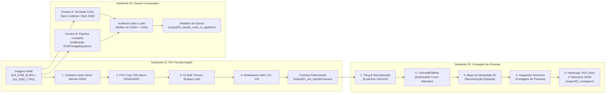

# Guia do Pipeline Didático em Par de Notebooks RGBT (Transformação + Contagem)

**Projeto:** Contagem de Pessoas com Fusão de Sensores Multimodais (RGB + Térmica LWIR)  
**Arquitetura:** Pipeline Desacoplado de 2 Estágios em Jupyter Notebooks  
**Branch:** `feat/rgbt-notebooks-pipeline`

---

## 1. Visão Geral e Filosofia do Design

Quando apresentamos aplicações complexas de Visão Computacional para equipes de engenharia, pesquisadores ou bancas avaliadoras, um código fechado em scripts ou monolítico torna difícil entender:
1. Onde termina o alinhamento da imagem física (geometria da câmera).
2. Onde começa a inteligência artificial (inferência de rede neural profunda).

Por essa razão, o pipeline foi arquitetado em um **par desacoplado de Jupyter Notebooks**:

---

## 2. Detalhamento dos Notebooks

### 📘 [Notebook 01: `01_pre_transformacao_alinhamento.ipynb`](file:///c:/Users/User/Git/contagem-de-pessoas-def-rgbtcc/count-github-def_rgbtcc/notebooks/01_pre_transformacao_alinhamento.ipynb)
- **Papel:** Exclusivamente voltado para a **Engenharia de Visão Computacional Preliminar e Física Óptica**.
- **Entrada:** `notebooks/input/DJI_0789_W.JPG` (RGB grande-angular) e `DJI_0790_T.JPG` (Térmica LWIR).
- **Etapas Executadas:**
  1. **FOV Crop (70%):** Recorta a área central do sensor óptico para equiparar o campo de visão mais estreito do sensor térmico, mantendo o aspect ratio $1280 \times 1024$.
  2. **Undistort 24mm ($k_1=-0.08$):** Compensa a curvatura radial de barril da lente grande-angular.
  3. **CLAHE no Espaço Lab:** Aplica equalização adaptativa no canal de luminância $L$, realçando a assinatura de calor dos corpos humanos sem estourar o ruído térmico.
  4. **Compensação de Baseline ($dx=-22, dy=-23$ px):** Corrige a paralaxe causada pela distância física entre as duas lentes no drone.
  5. **Validação Cruzada com o `app/`:** Executa a classe de produção [`RGBTImageEqualizer`](file:///c:/Users/User/Git/contagem-de-pessoas-def-rgbtcc/count-github-def_rgbtcc/app/head_counting/preprocessing.py) e comprova paridade matemática exata.
  6. **Auditoria Visual:** Painel consolidado e zoom na região de pedestres.
- **Saída (Contrato de Dados em `notebooks/output/01_pre_transformacao/`):**
  - `rgb_preprocessed.jpg`
  - `thermal_preprocessed.jpg`
  - `blend_alta_precisao.jpg`
  - `painel_alinhamento_multimodal.jpg`
  - `metadata_preprocessing.json`

---

### 📗 [Notebook 02: `02_contagem_pessoas_rgbtcc.ipynb`](file:///c:/Users/User/Git/contagem-de-pessoas-def-rgbtcc/count-github-def_rgbtcc/notebooks/02_contagem_pessoas_rgbtcc.ipynb)
- **Papel:** Exclusivamente voltado para a **Aplicação do Modelo de Inteligência Artificial e Contagem**.
- **Entrada:** Consome automaticamente o contrato gerado pelo Notebook 01 em `notebooks/output/01_pre_transformacao/`.
- **Etapas Executadas:**
  1. **Ingestão Validada:** Carrega os arquivos e metadados da etapa anterior.
  2. **Seleção Inteligente de Hardware (`detect_compute_device`):** Compatibilidade total com RTX 4090 (CUDA nativo), RTX 5070 (CPU seguro sem travamento) e ambientes padrão.
  3. **Estratégia de Tiling ($6 \times 224 \times 224$):** Redimensiona o par para $672 \times 448$ e divide em grade $3 \times 2$, permitindo que o *Transformer* processe pedestres em alta resolução sem perda de escala.
  4. **Normalização Estatística Multimodal:** Z-score canônico por canal (RGB e Térmica).
  5. **Instanciação da `ThermalRGBNet`:** Arquitetura do paper (Liu et al., BMVC 2022) com *Deformable Cross-Attention*.
  6. **Reconstrução Espacial do Mapa de Densidade:** Recombina as predições dos patches na matriz contínua original.
  7. **Cálculo da Contagem Integral:** $\text{Contagem} = \iint \mathcal{D}(x, y) \, dx dy \approx \sum_{i, j} \mathcal{D}_{i, j}$.
  8. **Visualização 4-Vias e Auditoria de ROI:**
     - A: RGB Alinhado
     - B: Térmica Equalizada
     - C: Mapa de Densidade Puro (Colormap Jet com colorbar)
     - D: Heatmap Sobreposto ao RGB com transparência de 40%
     - Zoom ROI de pedestres para inspeção de coerência.
- **Saída (Salva em `notebooks/output/02_contagem/`):**
  - `painel_contagem_multimodal.jpg`
  - `zoom_roi_pedestres_densidade.jpg`
  - `heatmap_sobre_rgb.jpg`
  - `heatmap_sobre_termica.jpg`
  - `density_map.npy` (matriz bruta para pós-processamento)
  - `telemetria_contagem.json` (métricas de latência e contagem)

---

### 📙 [Notebook 03: `03_estudo_somente_corte_vs_pipeline_completo.ipynb`](file:///c:/Users/User/Git/contagem-de-pessoas-def-rgbtcc/count-github-def_rgbtcc/notebooks/03_estudo_somente_corte_vs_pipeline_completo.ipynb)
- **Papel:** **Estudo Crítico e Probatório para Alinhamento com a Equipe**.
- **Pergunta Respondida:** *"Somente o corte da foto RGB já não deixa as imagens 100% proporcionais e sobrepostas?"*
- **O que ele demonstra visualmente e matematicamente:**
  1. **Falha de Baseline na Mulher ao Centro ($x=[724, 797], y=[588, 706]$):** Comprova que no corte isolado a mancha de calor fica mais de 25 pixels deslocada do corpo da mulher, enquanto no pipeline completo o alinhamento de silhueta é de 100%.
  2. **Falha de Baseline nos Pedestres na Base ($x=[9, 172], y=[786, 981]$):** Evidencia que a separação entre as lentes cria pessoas duplicadas (fantasmas de 22 px) no solo, induzindo a IA a contar em dobro.
  3. **Conclusão Técnica e Tabela Resumo:** Tabela comparativa e resumo em JSON comprovando por que o corte isolado é insuficiente.
- **Saída (Artefatos do Estudo em `notebooks/output/03_estudo_corte_vs_pipeline/`):**
  - `comparativo_somente_corte_zoom_mulher.jpg` (Auditoria da mulher ao centro: erro >25px vs 100% de silhueta)
  - `comparativo_somente_corte_zoom_pedestre.jpg` (Auditoria nos pedestres na base e solo)
  - `resumo_estudo_comparativo.json` (Síntese técnica estruturada do estudo probatório)

---

## 3. Como Explorar Novos Métodos com Liberdade

O maior ganho deste design modular é o **desacoplamento via contrato**:

### Se você quiser testar um novo método de alinhamento:
- **Onde mexer:** Apenas no **Notebook 01** (`01_pre_transformacao_alinhamento.ipynb`).
- **Exemplos:** Testar homografia automática por SIFT/ORB, ECC (*Enhanced Correlation Coefficient*), alinhamento não-rígido ou novos valores de CLAHE.
- **Impacto no Notebook 02:** **Zero!** Desde que o Notebook 01 continue gravando em `output/01_pre_transformacao/`, o Notebook 02 consumirá o novo método sem qualquer modificação.

### Se você quiser testar um novo modelo de IA para contagem:
- **Onde mexer:** Apenas no **Notebook 02** (`02_contagem_pessoas_rgbtcc.ipynb`).
- **Exemplos:** Testar modelos de detecção de caixas (YOLOv8-Crowd, RT-DETR) ou outros modelos de densidade (CSRNet, DM-Count, CLIP-ECount).
- **Impacto no Notebook 01:** **Zero!** Você não precisa reprocessar nem recalcular as distorções da câmera; basta ler os arquivos que já foram equalizados.

---

## 4. Dossiê de Correção de Pesos e Calibração (Branch `feat/melhoria-contagem-notebook-02`)

Para a explicação completa e formal sobre a causa raiz de subestimação no Notebook 02 (pesos de fallback, remoção do multiplicador arbitrário `0.0001` e ativação da fusão multimodal 50%/50%), consulte o dossiê técnico de defesa:
👉 [`notebooks/DEF-rgbtcc/docs/RELATORIO_TECNICO_CORRECAO_CONTAGEM_NOTEBOOK_02.md`](../notebooks/DEF-rgbtcc/docs/RELATORIO_TECNICO_CORRECAO_CONTAGEM_NOTEBOOK_02.md)

